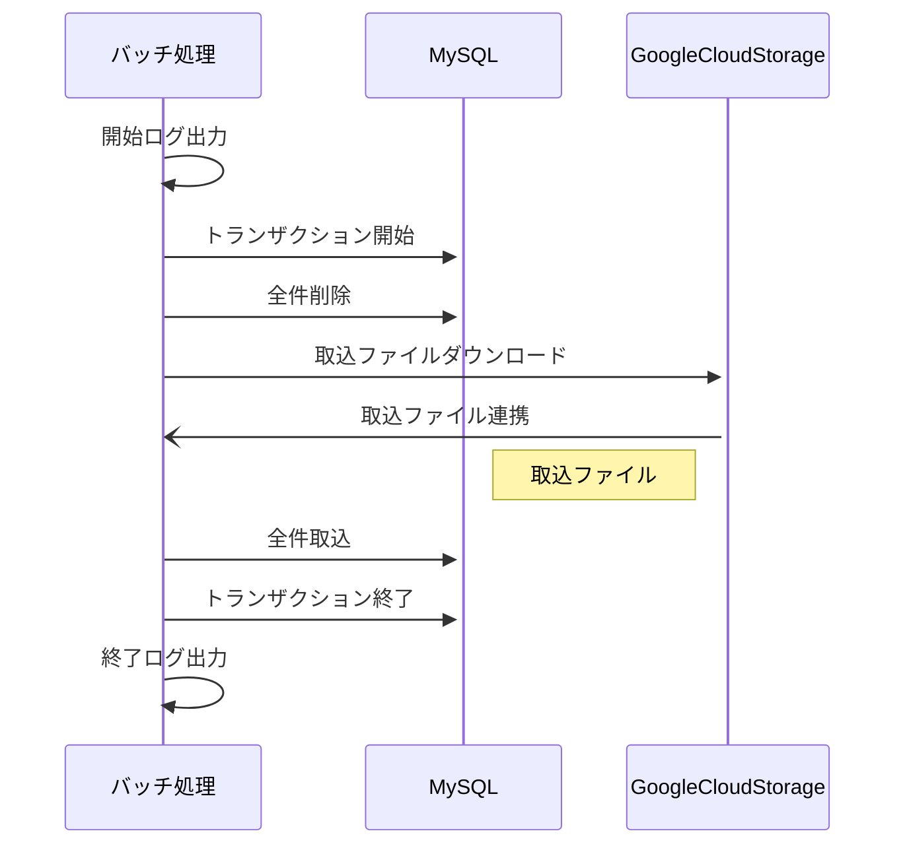

```mermaid
sequenceDiagram
    participant batch as バッチ処理
    participant mysql as MySQL
    participant gcs as GoogleCloudStorage
        batch ->> batch: 開始ログ出力
        batch ->>+ mysql: トランザクション開始
        batch ->>+ mysql: 全件削除
        batch ->>+ gcs: 取込ファイルダウンロード
        gcs -) batch: 取込ファイル連携
        NOTE left of gcs: 取込ファイル
        batch ->>+ mysql: 全件取込
        batch ->>+ mysql: トランザクション終了
        batch ->> batch: 終了ログ出力
```
